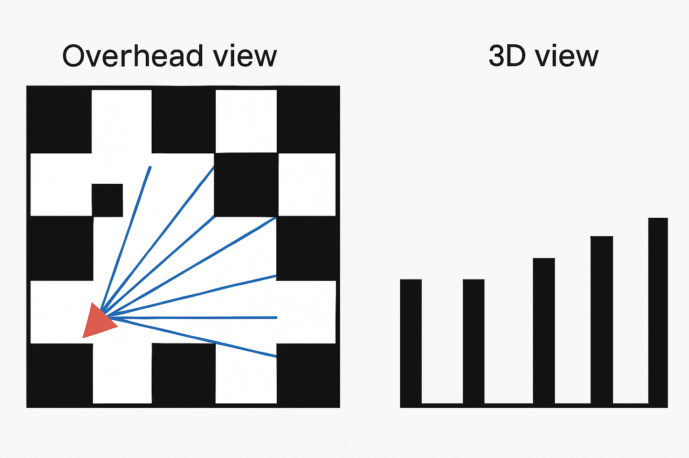

### Documentation of the Logic of the Project(cub3D).

This document is written with the purpose of explaining the all in all logic of the project and also the detailed explanation of each function of every part.

# cub3D

A MiniLibX‑based ray‑casting engine in C, inspired by Wolfenstein 3D.



## Table of Contents

* [Big‑Picture Logic](#big‑picture-logic)
* [Project Objective](#project-objective)
* [File Overview](#file-overview)
* [Detailed Code Explanation](#detailed-code-explanation)

  * [`main.c`](#mainc)
  * [`helper_tools.c`](#helper_toolsc)
  * [Header Files](#header-files)
* [Next Steps](#next-steps)

---

## Big‑Picture Logic

**cub3D** implements the classic ray‑casting algorithm to transform a 2D grid map into a real‑time, first‑person 3D view. For **each** vertical column of pixels:

1. **Cast a Ray**
   From the player’s position at a specific angle within the field of view.
2. **Step Through the Grid**
   Use DDA (Digital Differential Analyzer) to advance cell by cell along the ray until you hit a wall.
3. **Compute Distance**
   Measure how far the ray traveled to the wall—this determines the wall slice height.
4. **Project & Texture**
   Calculate on‑screen line height (`height = window_height / distance`), select the correct wall texture (based on side hit), and sample the texture column.
5. **Draw Floor & Ceiling**
   Fill pixels above the wall slice with the ceiling color and below with the floor color.

---

## Project Objective

Produce a **robust**, **memory‑safe**, **MiniLibX**‑based ray‑caster that:

* Parses a single `.cub` configuration file for:

  * **North/South/East/West** wall textures
  * Floor and ceiling RGB colors
  * A closed rectangular map with exactly one player start (N/S/E/W)
* Renders a real‑time 3D first‑person view with:

  * Wall textures
  * Flat floor & ceiling colors
* Supports:

  * **Movement:** W/A/S/D with collision checks
  * **Looking:** ←/→ arrow keys
  * **Exit:** ESC key or window close
* Validates input strictly and reports clear error messages for malformed files or maps

---

## File Overview

* **`cub3D.pdf`**
  Project specification and mandatory requirements.

* **`main.c`**

  * Entry point: argument validation
  * Map parsing via `parse_map()`
  * Initialization via `data_init()`
  * Initial render via `render_scene()`
  * Event hooks for keyboard and window events
  * `mlx_loop` for continuous updates

* **`helper_tools.c`**
  Utility functions:

  * `exit_error(msg)` — print error & exit
  * `ft_free_split(arr)` — free string arrays
  * `realloc_list(list, n)` — resize arrays of strings
  * `cleanup_partial_data(data)` — free partial state on error

* **Header Files**

  * `defines.h` — constants (window size, FOV, π, keycodes)
  * `functions.h` — function prototypes
  * `structs.h` — data structures for map, player, ray, drawing, scene

---

## Detailed Code Explanation

### `main.c`

```c
#include "../inc/functions.h"
```

Imports all prototypes, constants, and data structures.

```c
int main(int argc, char **argv)
{
    t_map      *map;
    t_cub_data *data;

    if (argc != 2)
        exit_error("Usage: ./cub3D <map.cub>");
```

* **Argument check:** ensures exactly one `.cub` file is provided.

```c
    map = parse_map(argv[1]);
```

* **Map Parsing:** loads textures, floor/ceiling colors, and validates the map grid (closed walls).

```c
    data = data_init(map);
```

* **Initialization:** sets player position/orientation, computes camera plane, initializes MiniLibX window & image.

```c
    render_scene(data, data->scene);
    mlx_put_image_to_window(
        data->scene->draw->mlx_conn,
        data->scene->draw->win,
        data->scene->draw->img,
        0, 0
    );
```

* **Rendering:** ray‑casting loop over screen columns, distance calculation, texture sampling, and floor/ceiling fill; then display image.

```c
    mlx_hook(
        data->scene->draw->win,
        KeyPress,
        KeyPressMask,
        key_press,
        data
    );

    mlx_hook(
        data->scene->draw->win,
        33,         // DestroyNotify
        1L<<17,
        close_window,
        data
    );

    mlx_loop(data->scene->draw->mlx_conn);
    return 0;
}
```

* **Event Loop:** handles movement/rotation, window close, then enters MLX loop.

---

### `helper_tools.c`

```c
void exit_error(char *msg)
{
    // Print "Error\n" + msg to stderr and exit(1).
}
```

Unified error reporting and exit.

```c
void ft_free_split(char **arr)
{
    // Free each string in arr and then the array itself.
}
```

Frees a NULL‑terminated string array.

```c
char **realloc_list(char **list, int new_count)
{
    char **new_list = malloc(sizeof(char *) * (new_count + 1));
    if (!new_list)
        exit_error("Memory allocation failed in realloc_list");
    // Copy pointers, null‑terminate, free old list.
    return new_list;
}
```

Safely resizes an array of strings.

```c
void cleanup_partial_data(t_cub_data *data)
{
    if (data->player)
        free(data->player);
    free(data);
}
```

Cleanup on partial failure.

---

### Header Files

* **`defines.h`** — window size, FOV, π, keycodes
* **`functions.h`** — parsing, validation, init, render, helpers
* **`structs.h`** — `t_map`, `t_player`, `t_ray`, `t_draw`, `t_scene`, `t_cub_data`

---

## Next Steps

1. Provide missing code blocks (e.g., full `key_press` logic, complete `parse_map`) to finish the walkthrough.
2. Copy this `README.md` into your repository and preview on GitHub to confirm formatting.

---

*Happy coding!*
